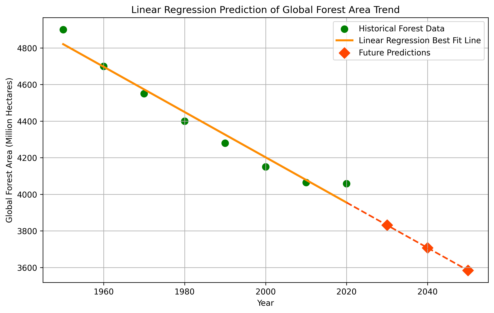

# Chapter 04 — Linear Regression

This chapter demonstrates a beginner-friendly implementation of **Linear Regression** using Python.

Using historical global forest area data, we train a Linear Regression model to understand how machines identify a trend from past observations and use that trend to predict future values.

---

## Concept Covered

In this example, you will learn:

- How to load a dataset from a CSV file
- How to prepare input and output variables
- How to train a Linear Regression model
- How to generate the best fit line
- How to make future predictions
- How to visualize the complete trend on a graph

---

## Files Included

- `forest_area_data.csv` → historical dataset used for training
- `forest_year_regression_demo.py` → main Python source code
- `requirements.txt` → required Python libraries
- `sample_output.png` → graph generated by the program

---

## Dataset Note

The dataset used in this chapter is based on publicly available long-term global forest cover estimates compiled from historical forestry reports and modern forest resource assessments.

---

## Required Libraries

Install all dependencies using:

```bash
pip install -r requirements.txt
```

---

## Run the Example

```bash
python3 forest_year_regression_demo.py
```

---

## Output

### Console Output


```bash
Loaded Historical Forest Dataset:

   Year  ForestArea
0  1950        4900
1  1960        4700
2  1970        4550
3  1980        4400
4  1990        4280
5  2000        4150
6  2010        4065
7  2020        4058

----------------------------------------

Linear Regression Model Trained Successfully.

Slope of Best Fit Line: -12.367857142857144
Intercept: 28938.07142857143

----------------------------------------

Future Predictions:

Predicted Forest Area in 2030: 3831.32 million hectares
Predicted Forest Area in 2040: 3707.64 million hectares
Predicted Forest Area in 2050: 3583.96 million hectares

----------------------------------------
```

---

### Regression Graph Output



---

## Learning Goal

The purpose of this chapter is not only to run a machine learning model, but to visually understand one of the most fundamental ideas in Machine Learning:

> Machines learn patterns from past data and extend those patterns into future predictions.

----------------------------------------
